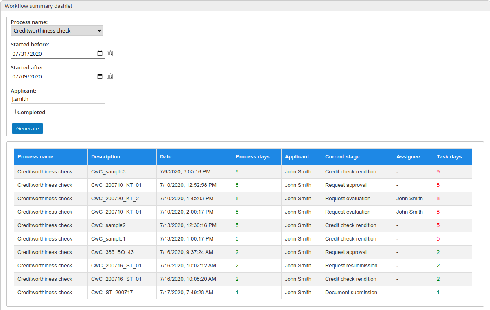

# workflow-summary
Alfresco addon - Workflow Summary Dashlet	Alfresco addon - Workflow Summary Dashlet

It enables the **GROUP_MANAGER** group to see and filter all workflows in the platform.

## How to get AMPS?
- `git clone https://github.com/howkymike/workflow-summary.git`
- `mvn clean package`

## How to test it?
- `git clone https://github.com/howkymike/workflow-summary.git`
- `cd workflow-summary`
- `./run build_start`

## Functionalities
- **GROUP_WORKFLOW_MANAGER** and admins have access to all functionalities of this dashlet
- **GROUP_WORKFLOW_SITE_MANAGER** has access only to site workflows they are members of
- Ability to filter and sort workflows using following fileds: site filter, workflow name, started after, started before, Initiator, Currently assigned authority. There is also one customizable additional filed which can be set via properties
- Ability to Reassign current workflow task to someone else
- alfresco-global.properties Properties:
	- **processdashlet.showGroupMembers** - boolean; true if you want to iterate over all group members and display them instead of the group name
	- **processdashlet.additionalFieldPropName** - string; Additional Filed property name (used in filter)
- Alfresco share properties (currenly only aviable to change in the processDashlet.get.properties files)
	- **table.currentTaskDaysLimit** :  the number of task days after which the number is shown in red color
	- **table.currentProcessDaysLimit** : the number of process days after which the number is shown in red color
	- **howkyProcessDashlet.defaultStartedAfterProcessDays** : default startedAfter date shown in filter control
	- **howkyProcessDashlet.defaultStartedBeforeProcessDays** : default startedBefore date shown in filter control
	- **howkyProcessDashlet.additionalFieldPropTitle** : label for the additional Field property

*Site workflow* is the workflows that ID's prefix is the site ID followed by a '__'. (i.e. site with id "test" may have its workflow with ID "test__insurance_claim")

### More addons:
[Howkymike addons](https://howkymike.github.io/alfrescoAddons.html)

#### Preview

